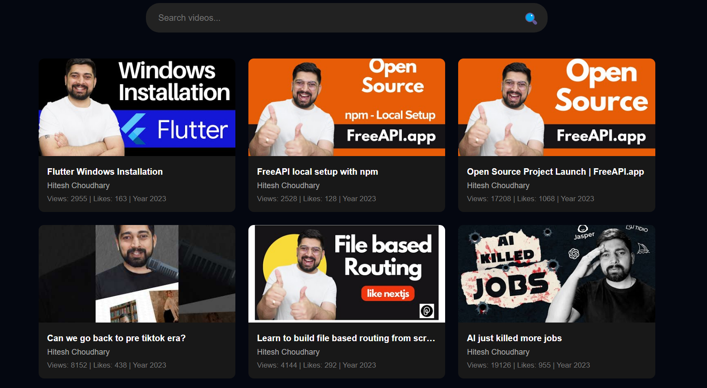

This is a **YouTube Video Listing Website** that shows a list of YouTube videos using an API.

<h5 style="text-align: center;">Youtube Video Listing Preview</h5>

 

## What is used in this project?

This project is built using three main technologies:

- HTML (HyperText Markup Language) → It creates the basic structure of the webpage (buttons, search bar, video grid, etc.).
- CSS (Cascading Style Sheets) → It makes the webpage look good (colors, fonts, layouts, etc.).
- JavaScript → It adds interactivity (fetching videos from an API, searching videos, showing loading animation, etc.).

2. How does it work?
   When you open the page, it starts loading YouTube videos.
   The loader (spinner) appears while the videos are being fetched.
   Once loaded, videos are displayed in a grid format with thumbnails, titles, and other details.
   You can search for videos using the search bar at the top.
   Clicking on a video opens it on YouTube in a new tab.

3. Features of this project
    
   ✅ Fetch YouTube videos from an API.
       
   ✅ Show a loader while fetching videos.
       
   ✅ Display videos with thumbnails, titles, and stats (views, likes, etc.).
       
   ✅ Search for videos based on the title or channel name.
       
   ✅ Open videos in YouTube by clicking on them.
